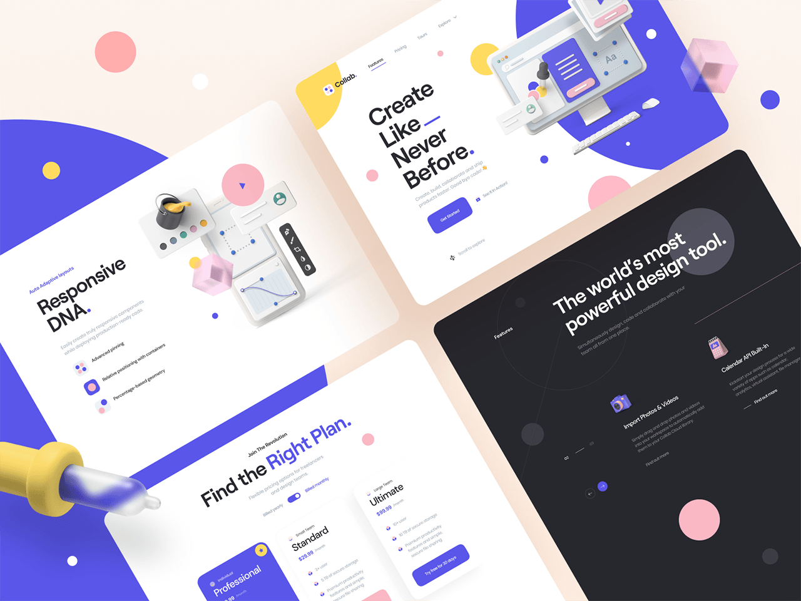

# Code Roast

*吐槽大会 ☆ 第三期*

---

本栏目可能含有以下场景

**思维跳跃**　/ **偏题万里** / **概念无数**

**反问成堆**　/ **肤浅主观** / **手忙脚乱**

---

开篇 / 代码风格 <!-- 平面排版 --> / 数据依赖

<style>
</style>

---

## 开篇

<div class="chat">

  <p class="left">我们在说吐槽大会，我们在追求什么？</p>

  说 bad case，达成统一，提醒大家写好代码

  <p class="left">为什么追求好代码？</p>


  对业务来说，我们是研发
  <br>
  对于代码来说，**我们自己就是用户**

  可读性优于复杂度、优于工作量、优于性能

  <p class="left">利于合作、提高效率？</p>

  说不准，但反过来确实会降低效率

  随着代码无节制的混乱，
  <br>
  代码的稳定性、可扩展性逐渐下降

  **排查的障碍**和**改动的成本**逐渐增加

  <p class="left">代码有混乱就一定要改吗？</p>

  不一定

  人对于美好的事务有向往 <!-- 所以天然想改 -->

  看现在改动的 ROI，以及长远的考虑
</div>

<style>
  .content h2 {
    margin-bottom: 0.5em;
  }

  .content .chat {
    display: flex;
    flex-direction: column;
    justify-content: flex-start;
    align-items: center;
    padding-bottom: 100px;
    width: 100%;
    max-height: 660px;
    
    overflow: scroll;
  }

  .content .chat::-webkit-scrollbar {
    display: none;
  }

  .chat p {
    position: relative;
    align-self: flex-end;
    margin: 0.4em;
    padding: 0 20px;
    /* border: solid 1px #8888; */
    border-radius: 32px;
    background: #eee;
  }


  .chat p.left {
    align-self: flex-start;
  }

  .chat p:before{
    content: '';
    position: absolute;
    left: -16px;
    top: -4px;
    width: 20px;
    height: 30px;
    border-width: 0;
    border-style: solid;
    border-color: transparent;
    border-bottom-width: 16px;
    border-bottom-color: currentColor;
    border-radius: 0 0 0 80px;
    color: #eee;
  }

  .chat p:not(.left):before{
    left: unset;
    right: -16px;
    border-radius: 0 0 80px 0;
  }
</style>

---

- 代码是否清晰易读很重要吗？
<!-- 重要是相对的，对产品来说确实除非影响到产出功能，否则不重要 -->
<!-- 但对代码来说，我们自己就是用户，很影响我们的使用体验 -->
- 为什么我们觉得有些代码清晰易读、有些代码混乱不堪？
- 当我们在说代码清晰、易读，我们到底在谈论什么？
- 凭什么你说它好看它就好看了？

---

## 代码风格

---

<!-- 配图 椰树包装 对比 dribbble 上的 app -->
<!-- https://dribbble.com/shots/13372241 -->


<style>
  .slide .content {
    flex-direction: row;
    justify-content: space-between;
  }

  img {
    padding: 0 80px;
    height: 680px;
    justify-self: center;
  }

</style>

---

**美丑是相对的**，没有绝对，所以才需要对比来讲 case

好看和不好看是在某种**审美观**下的对比

<!-- 例如不同年龄段审美观不一样，不同地区也有差异，不同时代就更不同了 -->

<!-- 同一份代码不同的人看来，有人会觉得 ok，有人会觉得 suck -->

怎么做好看，是在审美观下的`趋势`和`总结`，以及`原则`

<!-- 所以我想做的是对齐大家的代码风格认知 -->


---

## 平面设计基本原则

> 「用理性去总结设计方法，或者提升设计效率，
> <br>
> 而不是用理性去定义美的标准。」

---

<!-- 配图 希望展示我们是怎么从代码到设计的思维切换 -->
<!-- https://dribbble.com/shots/13788366 -->

```js

import React from 'react'

export default () => {
  const name = 'Hello'

  return (
    <TheZoo>
      <Zebra id={0714}>
        {name}
      </Zebra>
    </TheZoo>
  )
}

```

<->




<style>
  .slide .content {
    flex-direction: row;
    justify-content: space-between;
  }

  pre {
    background: #eee;
    border-radius: 16px;
  }

  img {
    height: 560px;
    justify-self: center;
  }

  pre .token.operator,
  pre .token.entity, 
  pre .token.url,
  pre .language-css .token.string,
  pre .style .token.string {
    background: unset; 
  }
</style>

---

