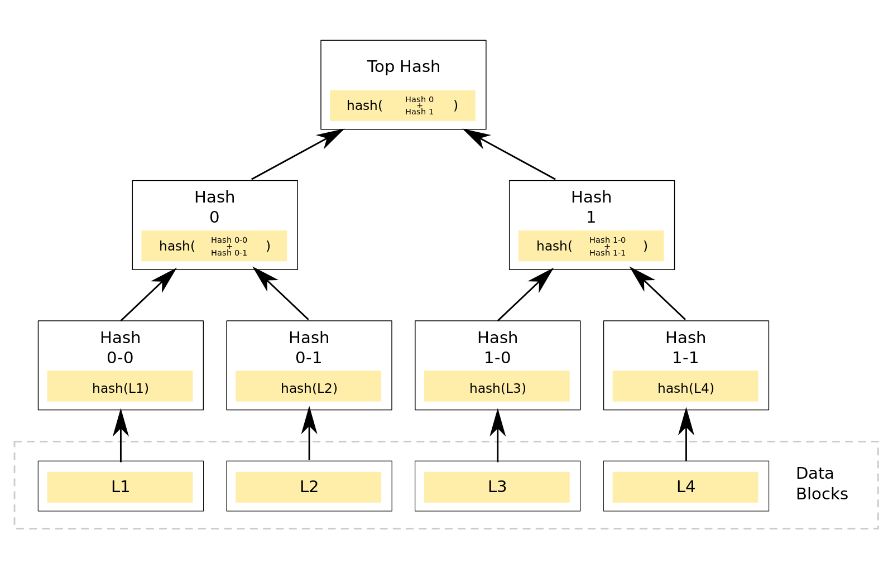
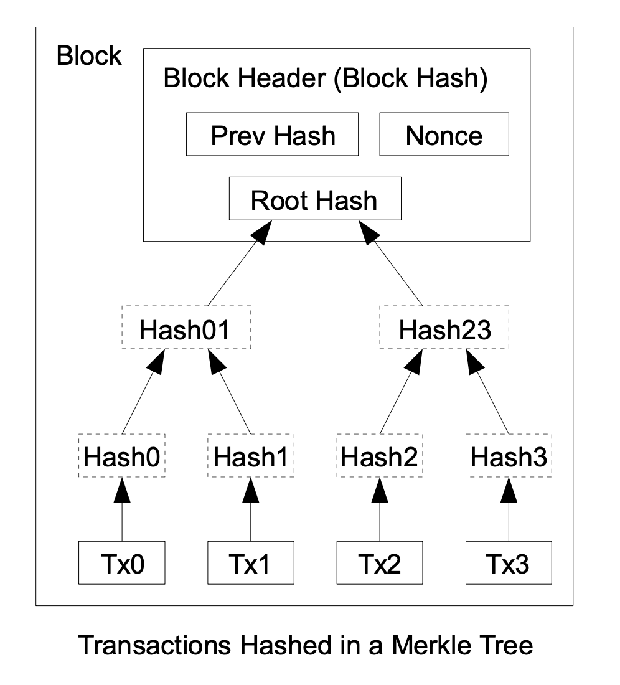
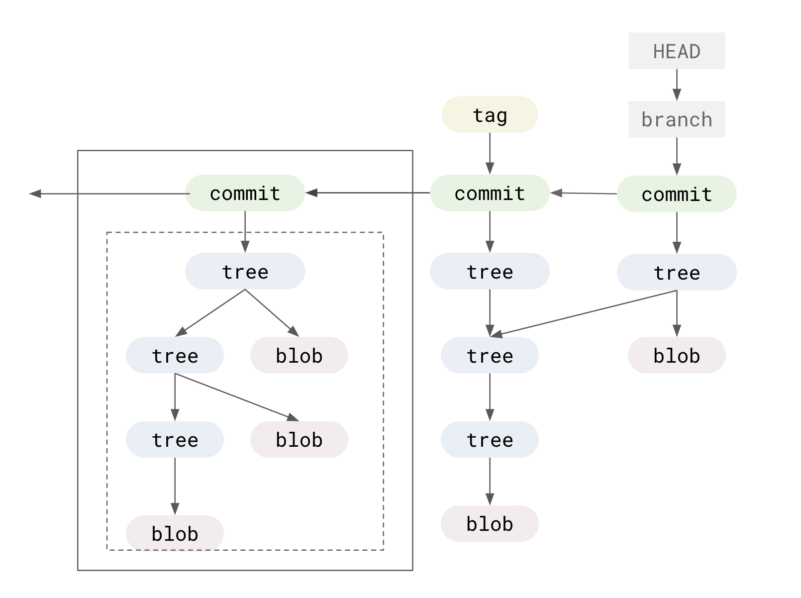
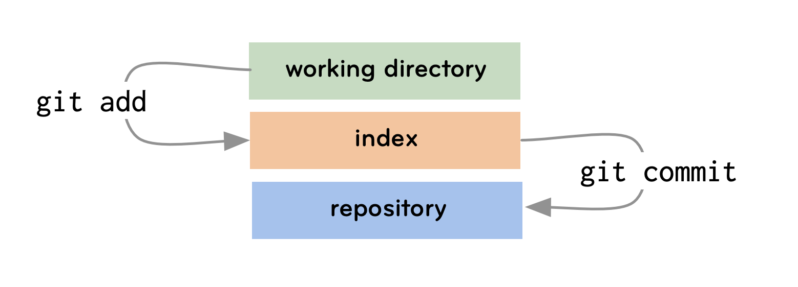
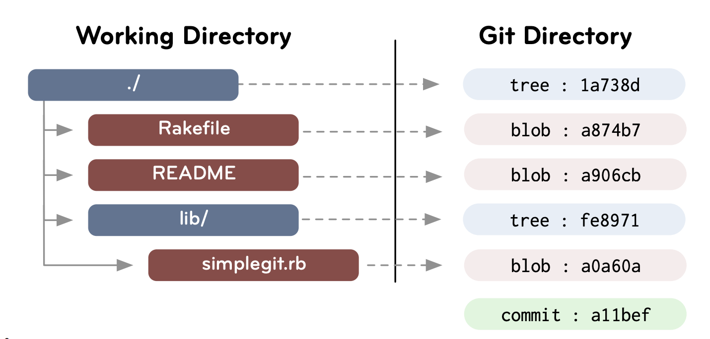
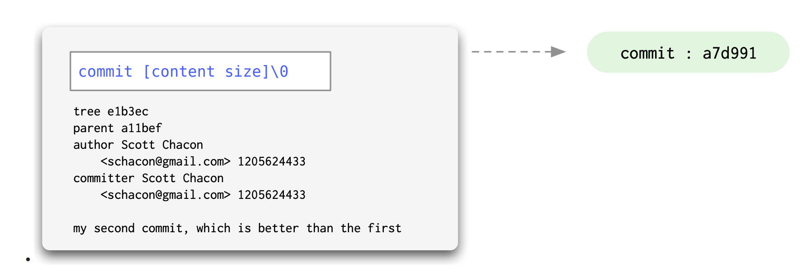
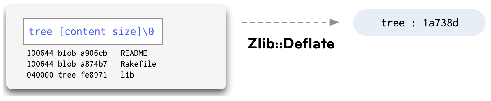
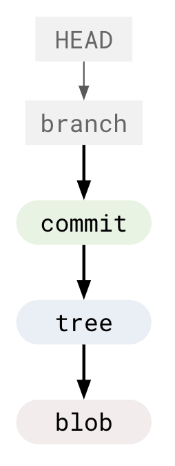
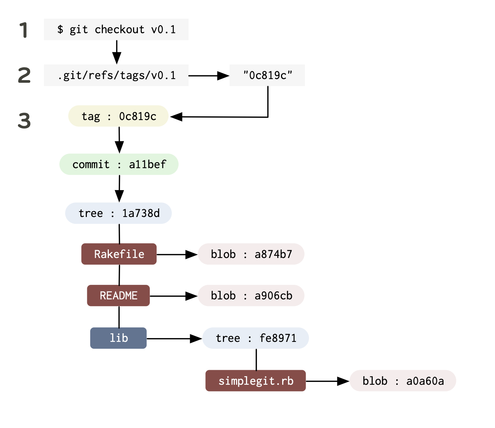

## A Glance at Git Merkle

the most familiar strange 'block chain'

---

- Merkle Tree
- Why is git not considered a block chain
- Git Workspace
- Git blob structure
- Porcelain & Plumbing
- Low-level usage
- CI with git flow

---



---


---


---



---


---

https://bitcoin.org/bitcoin.pdf

- Block Sign Chain
- PoW
- [Difficulty](https://learnmeabitcoin.com/beginners/difficulty)
- Block Reward
- Smart Contract (eg. ETH)
- IPO (eg. ETH)

---


---


---


[Why is git not considered a 'block chain'](https://stackoverflow.com/questions/46192377/why-is-git-not-considered-a-block-chain)

---

Why is git considered a 'block chain'

- similarity
- hash block, signature
- merkle

---

[Why is git not considered a 'block chain'](https://stackoverflow.com/questions/46192377/why-is-git-not-considered-a-block-chain)

- Block Sign Chain
- PoW
- [Difficulty](https://learnmeabitcoin.com/beginners/difficulty)
- Block Reward
- Smart Contract (eg. ETH)
- IPO (eg. ETH)

trust, financial

---


---



---



---



---




---




---


---

<style>
  p {
    display: flex;
  }

  p img {
    width: fit-content;
    height: fit-content;
  }
</style>




---

Git 所做的实质工作

将被改写的文件保存为数据对象，更新暂存区，记录树对象，最后创建一个指明了顶层树对象和父提交的提交对象

```bash
git cat-file
git show-ref
git update-ref 
git show-ref
git hash-object
```
---

```bash
# git add README.md && git commit -m 'docs: update README'

# git add
# 100644: file; 100755: exec; 120000: symbolic-link
# note snapshot

git hash-object -w README.md

git update-index --add --cacheinfo 100644 \
  blob-xxxxxxxxxxx README.md

# git commit

git write-tree

echo 'docs: update README' | git commit-tree tree-xxxxxxx -p 'HEAD^{commit}'

git update-ref refs/heads/master commit-xxxxxxxxxx
# # echo commit-xxxxxxxxxx > .git/refs/heads/master
```

---

```bash
git update-index --add --cacheinfo 100644 \
  $(git hash-object -w README.md) README.md

git update-ref refs/heads/master $(
  echo 'use commit-tree' | git commit-tree $(git write-tree) -p 'HEAD^{commit}'
)
```

---



---

```bash
# git checkout README.md
git read-tree HEAD^{tree}
git checkout-index -f README.md

# dev; git checkout master
git symbolic-ref HEAD refs/heads/master
git read-tree HEAD^{tree}
git checkout-index -f -a
```

---

```bash
# git reset HEAD

git read-tree HEAD^{tree}

# git reset HEAD --hard

git read-tree HEAD^{tree}
git checkout-index -f -a
```

---

git fetch remote src:dst

```bash
370bac699cfe2eeee6517991ed8c1dcaef50bf39
master
heads/master
origin/master

fetch = +refs/heads/master:refs/remotes/origin/master
fetch = +refs/heads/release-*:refs/remotes/origin/release-*
```

---

```bash
# on dev
git checkout master
git pull
```

```bash
git fetch origin +master:refs/heads/master
git checkout master
```

```bash
# or
git fetch origin master
git fetch . origin/master:master
git checkout master
```

---

```bash
git fetch . +370bac699cfe2eeee6517991ed8c1dcaef50bf39:refs/heads/release
# 和
git update-ref refs/heads/release 370bac699cfe2eeee6517991ed8c1dcaef50bf39
# 这两条命令是等价的

并且 
git fetch . +HEAD:refs/heads/test-fetch-new-branch
# 也等价于
git checkout -b test-fetch-new-branch
git update-ref refs/heads/test-fetch-new-branch HEAD
```

---

[git block playground](https://docs.google.com/presentation/d/1sbYcDZV-_3a_1Yw9WxMiJZFgQJo6ZlD47Y-8lmKowFM/edit?usp=sharing)

---

push 

- 创建联调平台 
- create merge 
- 升正式版号 
- 构建发版 
- 回到业务仓库 
- install commit push 
- 创建业务方联调平台
- 提 MR

---

push 自动化流程

- [x] 创建联调平台 (auto)
- create merge 
- [x] 升正式版号 (auto)
- [x] 构建发版 (auto)
- [x] 回到业务仓库 (auto)
- [x] install commit push (auto)
- [x] 创建业务方联调平台 (auto)
- [x] 提 MR (auto)

---


[](https://github.com/zthxxx)

[ [jovial](https://github.com/zthxxx/jovial) · [leetsolve](https://github.com/zthxxx/leetsolve) · [hexo-wikitten](https://github.com/zthxxx/hexo-theme-Wikitten) ]
