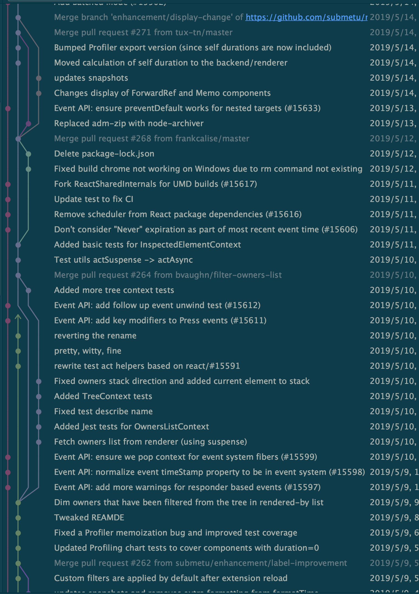
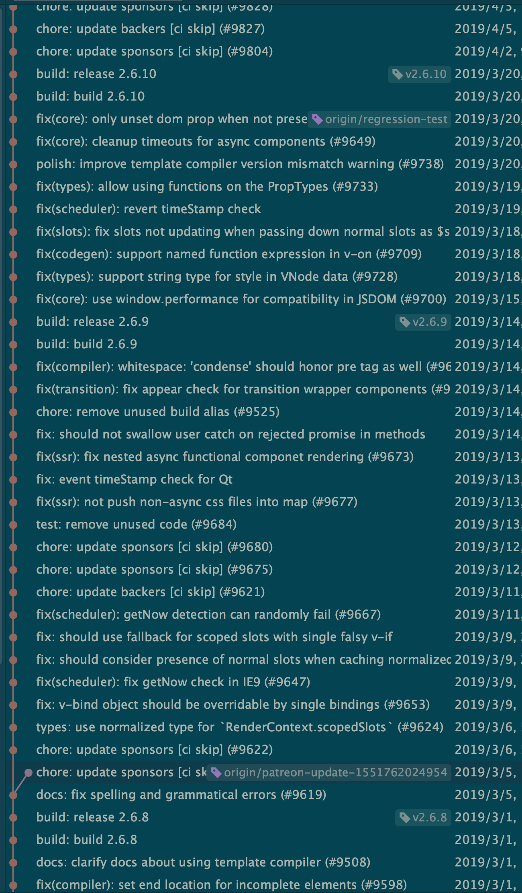
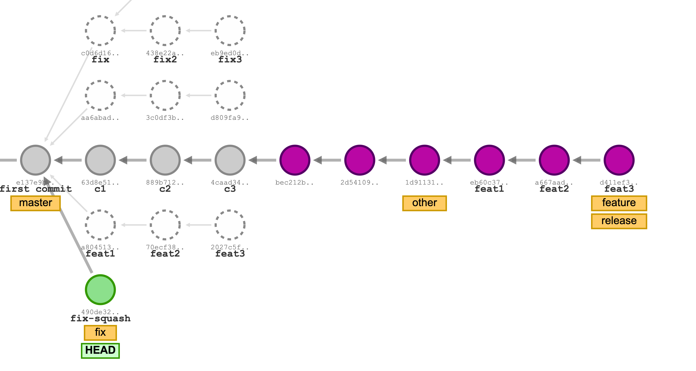
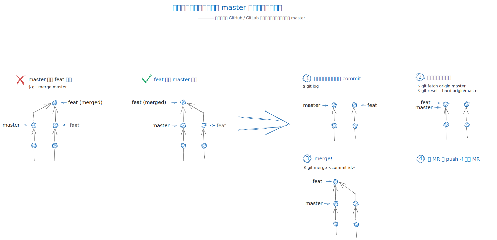

# Git Operate Proposal

*Git Workflow 总结与提倡*

<style>
  .content h1 {
    text-transform: none;
  }
</style>
---

## 核心目标：尽量回避冲突

额外期望：历史清晰直观

---

React

<div class="scroll">



</div>

<style>
  .content .scroll {
    max-height: 660px;
    overflow: scroll;
  }

  .content .scroll::-webkit-scrollbar {
    display: none;
  }


  .content .scroll p {
    margin: 0;
  }

  .content img {
    display: block;
    margin: auto;
    max-width: 60%;
    max-height: unset;
  }
</style>

---


Vue

<div class="scroll">



</div>

<style>
  .content .scroll {
    max-height: 660px;
    overflow: scroll;
  }

  .content .scroll::-webkit-scrollbar {
    display: none;
  }


  .content .scroll p {
    margin: 0;
  }

  .content img {
    display: block;
    margin: auto;
    max-width: 60%;
    max-height: unset;
  }
</style>


---

我们的问题

<div class="scroll">


</div>

<style>
  .content .scroll {
    max-height: 660px;
    overflow: scroll;
  }

  .content .scroll::-webkit-scrollbar {
    display: none;
  }


  .content .scroll p {
    margin: 0;
  }

  .content img {
    display: block;
    margin: auto;
    max-width: 60%;
    max-height: unset;
  }
</style>

---

「不管怎么混乱的 merge 都不会造成更多的 conflict」

「主要问题是分支之间的依赖造成的」

---

我们目前的 git flow

- master: 直接上线，只能合 hotfix, release
- release-*: 上线前回归测试，合各种 feat, 不紧急 fix
- fix-*: 临时的修复分支
- 单人 feat-*: 短期自己开发需要某个独立功能
- feature stable: 中长期并行于 release，多人开发大模块

---

我们目前的 git flow


<style>
  .content img {
    display: block;
    margin: auto;
    max-width: 80%;
  }
</style>

---

<!-- 一步步演示刚才的 git flow 怎么来的 -->

<iframe 
  src="https://git-school.github.io/visualizing-git/#free"
  scrolling="no"
  border="0"
  frameborder="no"
  framespacing="0"
  allowfullscreen="true"
  style="width: 1200px; height: 800px"
/>

---

刚才的模拟命令

```bash
# 前期准备
git checkout -b feature
git checkout -b other
git checkout -b release

git commit -m c1
git commit -m c2
git commit -m c3

# 模拟别人合到 release
git checkout other
git commit
git commit
git commit
git merge release

# MR: Merge `other` into `release`
git checkout release
git merge other

# 视角回到自己
git checkout feature
git commit -m feat1
git commit -m feat2
git commit -m feat3

git merge release

# MR: Merge `feature` into `release`
git checkout release
git merge feature

# 模拟别人有合 fix 到 release
git checkout master

git commit -m fix1
git commit -m fix2
git commit -m fix3
git commit -m fix4

# 回到 release 视角
git checkout release
git merge master

# MR: Merge `feature` into `release`
git checkout master
git merge release
```


<style>
  .content pre {
    max-height: 660px;
    overflow: scroll;
  }

  .content pre::-webkit-scrollbar {
    display: none;
  }
</style>

---

两个提倡

- 多用 rebase
- 多用 squash

---

两个限制

- 只有单人开发分支才能用 rebase
- 只有连续多个 fix 才该用 squash

---

rebase / squash





<style>
  .content img {
    display: block;
    margin: auto;
    max-width: 80%;
  }
</style>

---

演示 rebase / squash 方式

https://git-school.github.io/visualizing-git/#free

---




<style>
  .content img {
    display: block;
    margin: auto;
    max-width: 100%;
  }
</style>
