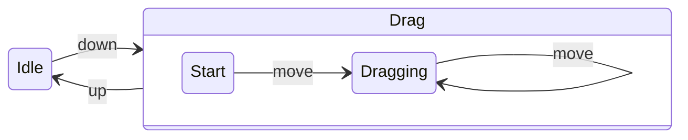
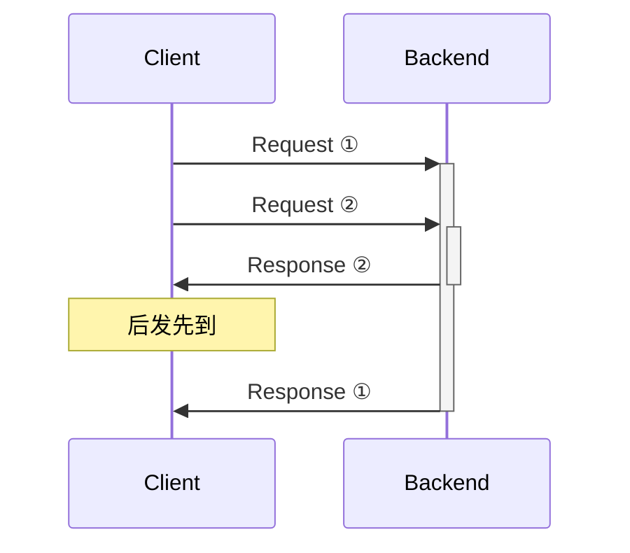
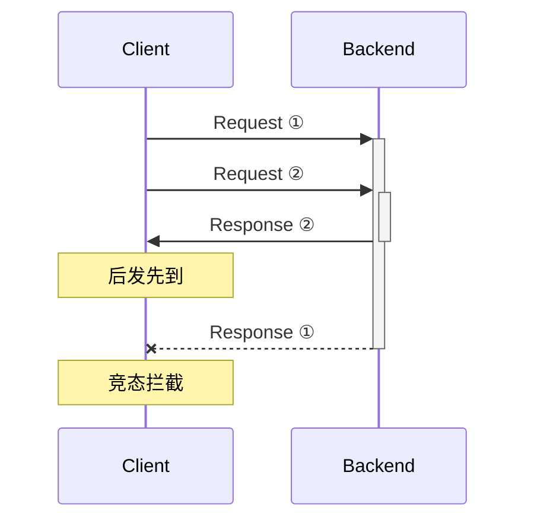
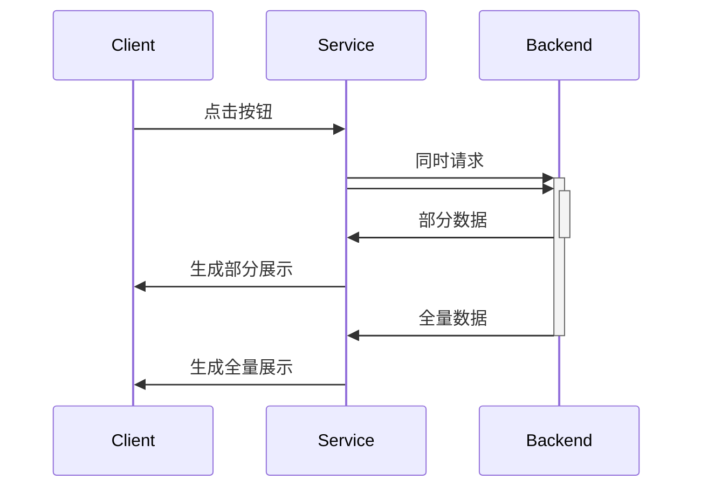
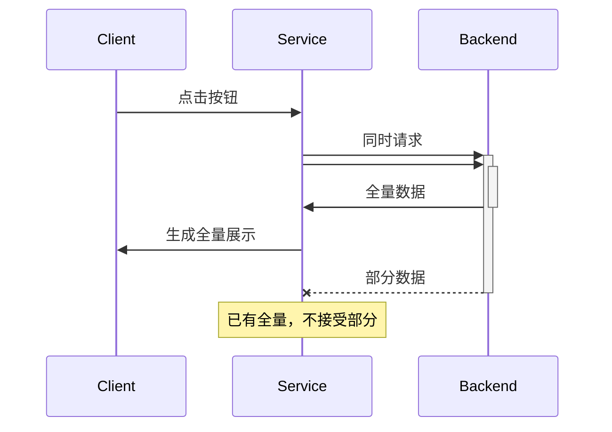

---

### Cases

- 元素选中拖拽交互
- 单元格来回 hover 防止 Popover 重复更新
- 输入搜索时，接口连续请求竞速
- 全量数据/部分数据 接口请求竞速
- 中文输入法 composition 事件组合
- 表格列宽的拖拽调整

---
routeAlias: '元素选中拖拽交互'
---

### 元素选中拖拽交互

`rxjs` / no `rxjs` 写法对比 →

---
layout: two-cols-header
---




::left::

```ts
import { tap, map, fromEvent, switchMap, takeUntil } from 'rxjs'

/** 元素选中拖拽交互 */
const subscriber = fromEvent<PointerEvent>(element, 'pointerdown').pipe(
  switchMap(down => {
    const origin = element.getBoundingClientRect()
    return fromEvent<PointerEvent>(document, 'pointermove').pipe(
      takeUntil(fromEvent(document, 'pointerup')),
      map(move => ({
        left: move.clientX - down.clientX + origin.left,
        top: move.clientY - down.clientY + origin.top,
      })),
    )
  }),
).subscribe(position => {
  setPosition(position)
})
```


::right::

```ts
/** 元素选中拖拽交互 */
const onPointerDown = (down: PointerEvent) => {
  const origin = element.getBoundingClientRect()

  const onPointerMove = (move: PointerEvent) => {
    const newPos = {
      left: move.clientX - down.clientX + origin.left,
      top: move.clientY - down.clientY + origin.top,
    }
    setPosition(newPos)
  }

  const onPointerUp = () => {
    document.removeEventListener('pointermove', onPointerMove)
    document.removeEventListener('pointerup', onPointerUp)
  }

  document.addEventListener('pointermove', onPointerMove)
  document.addEventListener('pointerup', onPointerUp)
}

element.addEventListener('pointerdown', onPointerDown)
```

<style>
  .slidev-layout {
    padding-inline: 1em;
    gap: 1em;
    --slidev-code-font-size: 0.4em;

    :deep() {
      .col-left, .col-right {
        margin-bottom: auto;
      }
    }
  }
</style>


---

### Popover 反复 hover 中的更新时机

`rxjs` / no `rxjs` 写法对比 →

---
layout: two-cols
---


```ts
/**
 * 单元格来回 hover 防止 Popover 重复更新
 *
 * - 在 canvas 表格单元格 cell 中 hover 事件会随鼠标移动多次触发
 * - hover/leave 单元格 cell 时，过一段延迟出现/取消 popover
 *   实现 mouseEnterDelay mouseLeaveDelay 延迟时间
 * - 来回移出再移入 cell 后，如果最终 cell 位置没有变化，则不需要更新
 */
updateCellHoverPopover(
  { get, set, meta },
  cellHoverPopover?: CellPopover,
) {
  const { cellHoverPopover$ } = get();
  const { interactSubscriptions } = meta;

  interactSubscriptions.cellHoverPopover ??= cellHoverPopover$
    .pipe(
      distinctUntilChanged((上次的, 新的) => {
        // 使同一个 cell 内移动不要重置 debounce
        return !hasCellChanged(上次的, 新的);
      }),
      debounceTime(200),
      filter(新的 => {
        const 上次的 = get().cellHoverPopover;
        return hasCellChanged(上次的, 新的);
      }),
      tap(新的 => {
        set({ cellHoverPopover: 新的 });
      }),
    )
    .subscribe();

  cellHoverPopover$.next(cellHoverPopover);
}

```

::right::

```ts
/**
 * 单元格来回 hover 防止 Popover 重复更新
 *
 * - 表格 canvas 中 hover 事件会随鼠标移动多次触发，此处内部判断是否变化过单元格
 * - hover/leave cell 时，过一段延迟出现/取消 popover
 *   实现 mouseEnterDelay mouseLeaveDelay 延迟时间
 * - 来回移出再移入后，如果最终单元格位置没有变化，则不需要更新
 */
updateCellHoverPopover(
  { get, set, meta },
  cellHoverPopover?: CellPopover,
) {
  // 创建防抖函数，每次延迟 200ms 后检查待处理值与当前状态
  meta.cellHoverPopoverDebounce ?? = _.debounce(
    () => {
      const 上次的 = get().cellHoverPopover
      // 仅在当前状态与待处理值不同时更新
      if (hasCellChanged(上次的, cellHoverPopover)) {
        set({ cellHoverPopover: state.lastEmitted })
      }
    },
    200,
  )

  const 上次的 = get().cellHoverPopover;
  // 使同一个 cell 内移动不要重置 debounce
  if (!hasCellChanged(上次的, cellHoverPopover)) {
    return
  }

  meta.cellHoverPopoverDebounce(cellHoverPopover)
}
```

<style>
  .slidev-layout {
    padding-inline: 1em;
    gap: 1em;
    --slidev-code-font-size: 0.4em;

    pre {
      height: 820px;
    }
  }
</style>

---


### 输入搜索时，接口请求竞速

<div class="flex justify-around items-center flex-row">


</div>


---
layout: two-cols
---

```ts
/**
 * 输入搜索时，接口请求竞速处理
 * 避免后发先到导致显示错误
 */

const input$ = useMemo(() => new Subject<InputEvent>(), )

useSubscription(() => {
  return input$.pipe(
    map(e => e.target.value.trim()),
    debounceTime(300),
    distinctUntilChanged(),
    switchMap(input => fetchSearchResult(input)),
    tap(result => setSearchResult(result)),
    catchError(error => console.error(error)),
  )
})

return {
  onInputChange: useCallback((e: InputEvent) =>  input$.next(e), []),
}

/*******************************************************************/

function useSubscription<T>(
  creator: () => Observable<T>,
  deps?: any[] = [],
) {
  useEffect(() => {
    const stream$ = creator();
    const subscription = stream$.subscribe();

    return () => subscription.unsubscribe();
  }, deps);
}
```

::right::

```ts
/**
 * 输入搜索时，接口请求竞速处理
 * 避免后发先到导致显示错误
 */

// 保存当前的 AbortController
const abortControllerRef = useRef<AbortController | null>(null);
// 用于判断是否有值改变
const previousInput = useRef('');

// 定义带有取消功能的搜索结果获取函数类型
type SearchResultFetcher = (
  input: string,
  signal: AbortSignal
) => Promise<SearchResult>;

const debouncedSearch = useCallback(
  _.debounce((input: string) => {
    // 如果有正在进行的请求，取消它
    if (abortControllerRef.current) {
      abortControllerRef.current.abort();
    }

    // 创建新的 AbortController
    const controller = new AbortController();
    abortControllerRef.current = controller;

    // 使用 AbortSignal 发起请求
    fetchSearchResult(input, controller.signal)
      .then(result => {
        // 只有当前 controller 仍然是最新的才更新结果
        if (abortControllerRef.current === controller) {
          setSearchResult(result);
        }
      })
      .catch(error => {
        // 忽略因为取消导致的错误
        if (error.name !== 'AbortError') {
          console.error(error);
        }
      })
      .finally(() => {
        // 清理已完成的 controller
        if (abortControllerRef.current === controller) {
          abortControllerRef.current = null;
        }
      });
  }, 300),
  []
)

const onInputChange = useCallback(
  (e: InputEvent) => {
    const input = e.target.value.trim();
    if (input === previousInput.current) return;
    previousInput.current = input;
    debouncedSearch(input);
  },
  [debouncedSearch]
);

return { onInputChange };
```

<style>
  .slidev-layout {
    padding-inline: 1em;
    gap: 1em;
    --slidev-code-font-size: 0.4em;

    pre {
      height: 820px;
    }
  }
</style>

<!--
得益于管道是有 next 和 complete 两种状态的，
`fetchSearchResult` 内部还能封装「接口期间被打断会取消接口」的能力，promise 就没这么方便了
-->

---

### 全量数据/部分数据 接口请求竞速

<div class="flex justify-around items-center flex-row">





</div>

---
layout: two-cols
---

```ts
/**
 * 全量数据/部分数据 两接口同时请求
 * - 通常「部分数据」接口请求较快，「全量数据」接口请求较慢
 * - 如果「部分数据」先返回就先展示部分，「全量数据」后返回再覆盖刷新
 * - 如果「全量数据」先返回就直接生成展示，「部分数据」后返回时直接丢弃不用
 */

const [isLoading, setIsLoading] = useState(false)

const 请求高亮展示内容 = usePersistCallback(() => {
  if (isLoading) {
    return
  }
  setIsLoading(true)

  const 对比全量数据$ = fetch对比全量数据接口()
  const 部分更新数据Diff$ = fetch部分更新数据Diff接口()

  merge(
    对比全量数据$,
    部分更新数据Diff$.pipe(
      takeUntil(对比全量数据$),
    ),
  )
  .pipe(
    map(data => 生成高亮展示内容(data)),
    tap(data => set高亮展示内容(data)),
    finalize(() => setIsLoading(false)),
  )
  .subscribe()
})
```

::right::

```ts
/**
 * 全量数据/部分数据 两接口同时请求
 * - 通常「部分数据」接口请求较快，「全量数据」接口请求较慢
 * - 如果「部分数据」先返回就先展示部分，「全量数据」后返回再覆盖刷新
 * - 如果「全量数据」先返回就直接生成展示，「部分数据」后返回时直接丢弃不用
 */
const [isLoading, setIsLoading] = useState(false)

const 请求高亮展示内容 = usePersistCallback(() => {
  if (isLoading) {
    return
  }
  setIsLoading(true)

  let isFullDataReceived = false

  // 请求全量数据
  fetch对比全量数据接口()
    .then(data => {
      isFullDataReceived = true
      const content = 生成高亮展示内容(data)
      set高亮展示内容(content)
    })
    .finally(() => setIsLoading(false))

  // 请求部分数据
  fetch部分更新数据Diff接口()
    .then(data => {
      // 如果全量数据已收到，则忽略部分数据
      if (!isFullDataReceived) {
        const content = 生成高亮展示内容(data)
        set高亮展示内容(content)
      }
    })
    .finally(() => setIsLoading(false))
})
```

<style>
  .slidev-layout {
    padding-inline: 1em;
    gap: 1em;
    --slidev-code-font-size: 0.4em;

    pre {
      height: 820px;
    }
  }
</style>

---

### 中文输入法 composition 事件组合

`rxjs` / no `rxjs` 写法对比 →

---
layout: two-cols
---

```ts
/**
 * 输入框中 IME 中文输入法 composition 事件处理
 *
 * 避免原生 input 框在 CJK 输入法输入过程中触发 onChange，
 * - 仅在非输入法模式、或输入法输入完成后触发 onChange
 * - 输入法输入过程中 (composition)，按 Enter 时 onChange 原始输入字母
 *
 * https://developer.mozilla.org/en-US/docs/Web/API/Element/compositionstart_event
 *
 * `setCurrentInput`: input 中显示的内容
 * `handleChange`: 输入法输入完成后回调
 */

// 当前 input 中显示的文本
const composition$ = useMemo(() => new BehaviorSubject(false), [])
// 是否处于输入法 composition 状态
const input$ = useMemo(() => new BehaviorSubject(''), [])

useSubscription(() => {
  return input$.pipe(
    skip(1),
    tap(input => setCurrentInput(input)),
    // 如果有 composition，则期间不用再响应输入，等待 composition 结束
    exhaustMap(input => {
      if (composition$.value) {
        return of(input)
      }
      return composition$.pipe(
        // takeWhile：当条件为 true 时保持管道流通，条件为 false 时关闭管道
        //    第二个参数 inclusive 表示关闭管道时是否发出最后一个值
        takeWhile(isComposition => isComposition),
        filter(() => false),
        // 结束的时始终抛出最新值
        endWith(input$.value),
      )
    }),
    tap((input) => handleChange?.(input)),
  )
})

return {
  /**
   * `<input>` 受控组件状态下当前展示文本
   * 对接原生 `<input>` currentText 属性
   */
  currentInput,
  /** 对接原生 `<input>` onChange 事件 */
  onInputChange: useCallback(e => input$.next(e.target.value), []),
  /** 对接原生 `<input>` onCompositionStart 事件 */
  onCompositionStart: useCallback(() => composition$.next(true), []),
  /** 对接原生 `<input>` onCompositionEnd 事件 */
  onCompositionEnd: useCallback(() => composition$.next(false), []),
}
```

::right::

```ts
/**
 * 输入框中 IME 中文输入法 composition 事件处理
 *
 * 避免原生 input 框在 CJK 输入法输入过程中触发 onChange，
 * - 仅在非输入法模式、或输入法输入完成后触发 onChange
 * - 输入法输入过程中 (composition)，按 Enter 时 onChange 原始输入字母
 *
 * https://developer.mozilla.org/en-US/docs/Web/API/Element/compositionstart_event
 *
 * `setCurrentInput`: input 中显示的内容
 * `handleChange`: 输入法输入完成后回调
 */

// 当前 input 中显示的文本
const [currentInput, setCurrentInput] = useState('')
// 是否处于输入法 composition 状态
const [isComposing, setIsComposing] = useState(false)

// 非 composition 状态下，输入框内容变化时直接触发 handleChange
const onInputChange = useCallback((e: React.ChangeEvent<HTMLInputElement>) => {
  const value = e.target.value
  setCurrentInput(value)
  if (!isComposing) {
    handleChange?.(value)
  }
}, [isComposing, handleChange])

// 开始输入法输入时，标记为正在 composition
const onCompositionStart = useCallback(() => {
  setIsComposing(true)
}, [])

// 输入法输入结束后，结束 composition 状态，并触发 handleChange
const onCompositionEnd = useCallback((e: React.CompositionEvent<HTMLInputElement>) => {
  setIsComposing(false)
  const value = e.currentTarget.value
  handleChange?.(value)
}, [handleChange])


return {
  /**
   * `<input>` 受控组件状态下当前展示文本
   * 对接原生 `<input>` currentText 属性
   */
  currentInput,
  /** 对接原生 `<input>` onChange 事件 */
  onInputChange: useCallback(e => input$.next(e.target.value), []),
  /** 对接原生 `<input>` onCompositionStart 事件 */
  onCompositionStart: useCallback(() => composition$.next(true), []),
  /** 对接原生 `<input>` onCompositionEnd 事件 */
  onCompositionEnd: useCallback(() => composition$.next(false), []),
}
```

<style>
  .slidev-layout {
    padding-inline: 1em;
    gap: 1em;
    --slidev-code-font-size: 0.4em;

    pre {
      height: 820px;
    }
  }
</style>

---

### 表格列宽的拖拽调整

`rxjs` / no `rxjs` 写法对比 →


---
layout: two-cols
---

```ts
/**
 * 表格列宽的拖拽调整
 * - hover 到表头列间边界显示 indicator 指示线
 * - 直接仅点击列边界指示线不做任何操作
 * - 在指示线上按下后可拖拽，仅有指示线跟随移动
 * - 在松手释放拖拽结束后，才触发列宽更新
 */
function useColumnResize() {
  const dragStart$ = useMemo(() => new Subject<null>(), [])
  const dragEnd$ = useMemo(() => new Subject<{ columnKey: string; width: number }>(), [])
  const tableHeaderHover$ = useMemo(() => new Subject<TableMouseEventArgs>(), [])

  // 是否在拖拽调整中
  const resizing$ = useMemo(() =>
    merge(
      dragStart$.pipe(map(() => true)),
      dragEnd$.pipe(map(() => false)),
    ).pipe(
      startWith(false),
      shareReplay(1)
    ),
  [dragStart$, dragEnd$]);

  // 处理鼠标悬停在列边界时的效果
  useSubscription(() => {
    return combineLatest([resizing$, tableHeaderHover$]).pipe(
      // 只在未拖拽时，需要处理列边界悬停效果
      filter(([isResizing]) => !isResizing),
      map(([, tableMouseEvent]): TableMouseEventArgs => tableMouseEvent),
      filter(tableMouseEvent => {
        const canResize = checkIsOnColumnEdge(tableMouseEvent)
        return canResize
      }),
      map(tableMouseEvent => {
        const columnLeft = calculateColumnLeft(tableMouseEvent)
        return columnLeft
      }),
      distinctUntilChanged(),
      tap(columnLeft => store.dispatch.setColumnResizeLineLeft(columnLeft)),
    );
  });

  useSubscription(() => {
    // 处理列宽调整拖拽
    return dragStart$.pipe(
      switchMap(() => {
        const mouseMove$ = fromEvent<MouseEvent>(document, 'mousemove');

        // 处理拖拽中的调整线移动
        const resizeDragging$ = mouseMove$.pipe(
          tap(event => {
            const tableBoundingLeft = store.dispatch.getTableBoundingClientRect().left || 0;
            store.dispatch.setColumnResizeLineLeft(event.clientX - tableLeft);
          })
        );

        // 处理拖拽结束的列宽更新
        const resizeComplete$ = dragEnd$.pipe(
          // 确保只有当有真正的拖拽移动后才执行列宽更新
          skipUntil(mouseMove$),
          take(1),
          tap(({ columnKey, width }) => {
            store.dispatch.updateColumnsWidth({ columnKey, width });
            store.dispatch.setColumnResizeLineLeft(-1);
          })
        );

        return resizeDragging$.pipe(
          takeUntil(resizeComplete$)
        );
      })
    );
  });

  const onColumnResizeStart = usePersistCallback(() => {
    dragStart$.next(null);
  });

  const onColumnResizeEnd = usePersistCallback(
    (col: Column, width: number) => {
      dragEnd$.next({
        columnKey: col.id!,
        width: width,
      });
    },
  );

  const onMoveOnTable = usePersistCallback((args: TableMouseEventArgs) => {
    tableHeaderHover$.next(args);
  });

  return {
    onColumnResizeStart,
    onColumnResizeEnd,
    onMoveOnTable,
  };
}
```

::right::

```ts
/**
 * 表格列宽的拖拽调整
 * - hover 到表头列间边界显示 indicator 指示线
 * - 直接仅点击列边界指示线不做任何操作
 * - 在指示线上按下后可拖拽，仅有指示线跟随移动
 * - 在松手释放拖拽结束后，才触发列宽更新
 */
function useColumnResize() {
  const [isResizing, setIsResizing] = useState(false);
  const [hasMouseMoved, setHasMouseMoved] = useState(false);

  // 使用 useRef 存储事件处理函数引用
  const eventHandlersRef = useRef({
    mousemove: null
  });

  // 处理鼠标悬停在列边界时的效果
  const onMoveOnTable = usePersistCallback((args) => {
    // 仅在非调整状态下处理悬停
    if (!isResizing) {
      const canResize = checkIsOnColumnEdge(args);

      if (canResize) {
        const columnLeft = calculateColumnLeft(args);
        store.dispatch.setColumnResizeLineLeft(columnLeft);
      }
    }
  });

  // 开始调整列宽
  const onColumnResizeStart = usePersistCallback(() => {
    setIsResizing(true);
    setHasMouseMoved(false);

    // 创建鼠标移动事件处理函数
    const handleMouseMove = (event) => {
      setHasMouseMoved(true);
      const tableBoundingLeft = store.dispatch.getTableBoundingClientRect().left || 0;
      store.dispatch.setColumnResizeLineLeft(event.clientX - tableBoundingLeft);
    };

    // 保存到 ref 中并添加事件监听器
    eventHandlersRef.current.mousemove = handleMouseMove;
    document.addEventListener('mousemove', handleMouseMove);
  });

  // 结束调整列宽
  const onColumnResizeEnd = usePersistCallback((col, width) => {
    // 移除全局鼠标事件监听
    if (eventHandlersRef.current.mousemove) {
      document.removeEventListener('mousemove', eventHandlersRef.current.mousemove);
      eventHandlersRef.current.mousemove = null;
    }

    // 只有当鼠标真正移动过，才更新列宽
    if (hasMouseMoved) {
      store.dispatch.updateColumnsWidth({
        columnKey: col.id,
        width: width
      });
    }

    // 隐藏调整线
    store.dispatch.setColumnResizeLineLeft(-1);
    setIsResizing(false);
  });

  // 当组件卸载时清理事件监听
  useEffect(() => {
    return () => {
      if (eventHandlersRef.current.mousemove) {
        document.removeEventListener('mousemove', eventHandlersRef.current.mousemove);
        eventHandlersRef.current.mousemove = null;
      }
    };
  }, []);

  return {
    onColumnResizeStart,
    onColumnResizeEnd,
    onMoveOnTable
  };
}
```

<style>
  .slidev-layout {
    padding-inline: 1em;
    gap: 1em;
    --slidev-code-font-size: 0.4em;

    pre {
      height: 820px;
    }
  }
</style>
