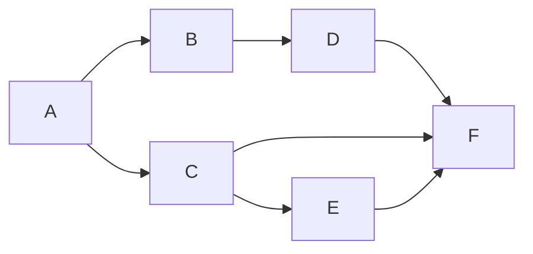
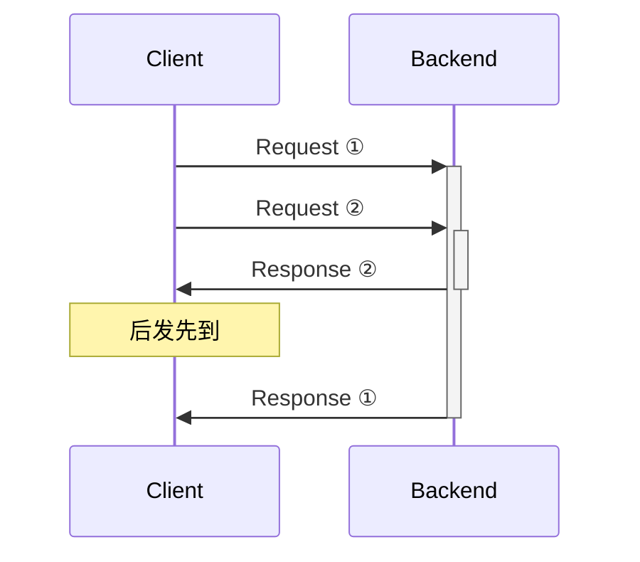

## 从「管道」开始具象化理解 RxJS

目的 / 定位 / 作用 / 意义

<!--
本次分享能 **获得** 什么？

在项目中想用 rxjs，先跟大家分享下这个库。

[入门] 帮助 **刚接触** rxjs 的初学者抛开互联网上繁杂的 rxjs 概念解释，

换一种简单直观的理解方式来理解 rxjs 的概念、管道的理念，

最终帮助大家在项目中实际使用 rxjs 的能力落地开发代码。

PS: 为啥用 Slidev 的形式？  因为需要展示代码高亮，以及最初想做交互性的动画
-->

---

### "Think of `RxJS` as `Lodash` for async stream."

<!--
事到如今没人会来讲说我们要推大家用 Lodash，要来讲讲 Lodash 是什么，怎么用
-->

---

### 但，对于 RxJS 仍然缺少直觉

<v-click>
Stream(流) => Pipe(管道)
</v-click>

<!-- 直觉是指「从架构/流程的图形化能几乎 1:1 映射到代码结构/写法」 -->

---
layout: two-cols
---

本次会涉及的部分

- 纯主观的 `rxjs` 是什么
- 形象的管道中的概念
- 作用/意义以及如何使用
- 写法以及对比其他范式
- 案例 Cases

::right::

不会涉及的部分

- 冷流 / 热流 / `multicast`
- `share` / `connect` 等一百个 api
- 进阶技巧与踩坑
- 源码讲解

<br/>

<style>
  .slidev-layout {
    :deep(.col-left) {
      @apply pl-20;
    }
  }
</style>


<!--
TODO:
  - 为现有动画增加管道出入连线
  - `takeUntil` 从中间往上下炸管道的过程动画演示
  - 过几个常用常用操作符的动画演示
  - 「解耦 <-> 隔离」一章的代码 case
-->

---

```ts
import { tap, map, fromEvent, switchMap, takeUntil } from 'rxjs'

const subscriber = fromEvent<PointerEvent>(element, 'pointerdown').pipe(
  switchMap(down => {
    const origin = element.getBoundingClientRect()
    return fromEvent<PointerEvent>(document, 'pointermove').pipe(
      takeUntil(fromEvent(document, 'pointerup')),
      map(move => ({
        left: move.clientX - down.clientX + origin.left,
        top: move.clientY - down.clientY + origin.top,
      })),
    )
  }),
  tap(position => setPosition(position)),
).subscribe()
```

<!--
先看一段代码引子，直观感受今天的内容
-->

---

#### 不管之前有没有接触过 `rxjs`， <br/> 忘掉之前网上听说的内容，让我们换个视角重新理解。


---

### 从现在开始都是「管道」

---

### 概念

- 管道 / 管道模板
- 输出源 / 输出源构造器
- 传送入口

---
layout: two-cols
---

<RiveCanvas
  class='w-[600px] h-[400px]'
  artboard='纯输入输出直线'
/>

::right::

有输入和输出的"一节"管道，

啥也没做

---
layout: two-cols
---

<RiveCanvas
  class='w-[600px] h-[400px]'
  artboard='纯输入输出管道'
/>

::right::

但管道也可以包含逻辑的

---
layout: two-cols
---

<RiveCanvas
  class='w-[600px] h-[400px]'
  artboard='tap 观察'
/>

::right::

简单点，一个观察者，不修改数据

<v-click>

```ts {all|4-6}{lines:true}
import { tap } from 'rxjs'

subject$.pipe(
  tap((value) => {
    console.log(value)
  }),
).subscribe()
```

</v-click>

---
layout: two-cols
---

<RiveCanvas
  class='w-[596px] h-[400px]'
  artboard='Filter 管道'
/>

::right::

按条件拦截数据， <br/>
但不会修改值的"一节"管道

<v-click>

```ts {all|4-6}{lines:true}
import { filter } from 'rxjs'

subject$.pipe(
  filter((value) => {
    return isGreen(value)
  }),
).subscribe()
```

</v-click>


---
layout: two-cols
---

<RiveCanvas
  class='w-[600px] h-[400px]'
  artboard='map 管道'
/>

::right::

把输入的东西拿来处理， <br/>
往出口丢处理后的新东西的"一节"管道

<v-click>

```ts {all|4-6}{lines:true}
import { map } from 'rxjs'

subject$.pipe(
  map((value) => {
    return toPurple(value)
  }),
).subscribe()
```

</v-click>


---
layout: two-cols
---

<RiveCanvas
  class='w-[700px] h-[800px]'
  artboard='管道模板'
/>

::right::

"管道"的实体是从模板里创建的

<v-click>

```ts {all|3-4,10-14}{lines:true}
import { tap, filter, map } from 'rxjs'

// 编排好了管道的模板
const pipe$ = subject$.pipe(
  tap((value) => console.log(value)),
  filter((value) => isGreen(value)),
  map((value) => toPurple(value)),
)

// 从模板创建管道
pipe$.subscribe()

// 多次创建多个独立管道
pipe$.subscribe()
```

</v-click>

---
layout: two-cols
---

<RiveCanvas
  class='w-[700px] h-[800px]'
  artboard='管道模板'
/>

::right::

完整的"一根"管道是包含输入的 <br/>
例如`subject$` 作为管道的输入 <br/>

```ts {*}{lines:true}
import { Subject, tap, filter, map } from 'rxjs'

const subject$ = new Subject<Value>()
// 编排好了管道的模板
const pipe$ = subject$.pipe(...)

// 多次创建多个独立管道
pipe$.subscribe()
pipe$.subscribe()
pipe$.subscribe()

// 传送口，打开盖子输入
subject$.next(value)
```

---
layout: two-cols
---

<RiveCanvas
  class='w-[700px] h-[600px]'
  artboard='Subject'
/>

::right::


<small>普通管道只有一个出口，</small>
<small>只能连一个管道</small>
`subject$` 是特殊的「`传送入口`」，一对多输出

```ts {all|3,13}{lines:true}
import { Subject, tap, filter, map } from 'rxjs'

const subject$ = new Subject<Value>()
// 编排好了管道的模板
const pipe$ = subject$.pipe(...)

// 多次创建多个独立管道
pipe$.subscribe()
pipe$.subscribe()
pipe$.subscribe()

// 传送口，打开盖子输入
subject$.next(value)
```


---
layout: two-cols
---

<RiveCanvas
  class='w-[600px] h-[600px]'
  artboard='Observable'
/>

::right::

`observable` 输出源的构造器 <br/>
从内部产生数据，或从外部拿数据输输出

```ts {all}{lines:true}
import { Observable } from 'rxjs'

// observable$ 只是 “输出源构造器”
const observable$ = new Observable<Value>((subscriber) => {
  for (let i = 0; i < 10; i++) {
    subscriber.next(i)
  }
  subscriber.complete()
})

// subscribe 时，输出源才被构造器创建出来
observable$.subscribe()
observable$.subscribe()
observable$.subscribe()
```

---
layout: two-cols
class: 'w-[800px]'
---

<RiveCanvas
  class='w-[700px] h-[800px]'
  artboard='管道模板'
/>

::right::

现在已经完全了解管道模型了

- 一节管道操作 → `tap` / `filter` / `map`
- 管道模板 → `pipe$ = subject$.pipe(...)`
- 创建管道 → `pipe$.subscribe()`
- 传送入口 → `subject$ = new Subject()`
- 通过入口发数据 → `subject$.next(value)`

<style>
  .slidev-layout {
    ul {
      font-size: 2rem;
    }
  }
</style>


---

那么 `rxjs` 管道和 `EventEmitter` 有什么异同？


```ts
const subject$ = new Subject<Value>()
subject$.subscribe(...)
subject$.next(...)

const manager = new EventEmitter()
manager.on('typing', ...);
manager.emit('typing', ...);
```

---
layout: two-cols
---


```ts
const typing$ = new Subject<Value>()
const copy$ = new Subject<Value>()

typing$.subscribe(...)
typing$.next(...)

copy$.subscribe(...)
copy$.next(...)


const manager = new EventEmitter()
manager.on('typing', ...);
manager.emit('typing', ...);

manager.on('copy', ...);
manager.emit('copy', ...);
```

::right::

- 因为还没接触到核心的**异步编排**，目前能力基本一样，只有写法的区别
- `Subject` 这个词是指 Topic 的概念，<br/>
  表示这个 `Subject` 传入的东西应该是属于这个 **主题** 限制的 <br/>
- `EventEmitter` 是通过字符串集中管理事件 <br/>
  `Subject` 通过引用在上层集中管理 <br/>
- 管道是状态机的集合，把状态转换和逻辑封装在管道内部


<style>
  .slidev-layout {
    ul {
      font-size: 2rem;
    }

    :deep() {
      .col-left {
        width: 600px;
      }
      .col-right {
        width: 800px;
        left: -60px;
        position: relative;
      }
    }
  }
</style>

---

### 异步 时序性消息 的 拓扑编排

<div class="flex justify-around items-center flex-row">



</div>

---


<style>
  .slidev-layout {
    img {
      width: 660px;
      filter: invert();
    }
  }
</style>


---
layout: two-cols
---

<RiveCanvas
  class='w-[700px] h-[800px]'
  artboard='switchMap'
/>

::right::

嵌套管道: <br/>
<small>可内部创建管道 或消费外部管道</small>

- `concatMap`: 排队，阻塞等待 <br/>
  *(一个管道完了才会开始下一个管道，都会执行)*
- `mergeMap`: 并行，穿插输出 <br/>
  *(多个管道可以同时输出)*
- `switchMap`: 抢占打断，新的优先，优先处理新任务  <br/>
  *(旧的管道没有完成，就直接移动走切换成新的管道)*
- `exhaustMap`: 请勿打扰，占用时不接受输入 <br/>
  *(没有完成时来新的管道直接被丢弃)*

<style>
  .slidev-layout {
    ul {
      font-size: 2rem;
    }
    em {
      opacity: 0.6;
      font-size: 80%;
    }

    :deep() {
      .col-left {
        width: 600px;
      }
      .col-right {
        width: 800px;
        left: -60px;
        position: relative;
      }
    }
  }
</style>

---


Marble Diagrams 弹珠图


<style>
  .slidev-layout {
    img {
      width: 800px;
    }
  }
</style>

<!--
- https://www.sglavoie.com/posts/2023/10/01/first-steps-with-rxjs/
-->

---
layout: iframe

# the web page source
url: https://rxjsmarbles.dev/switchMap
---

---

再回头读这段代码

```ts
import { tap, map, fromEvent, switchMap, takeUntil } from 'rxjs'

const subscriber = fromEvent<PointerEvent>(element, 'pointerdown').pipe(
  switchMap(down => {
    const origin = element.getBoundingClientRect()
    return fromEvent<PointerEvent>(document, 'pointermove').pipe(
      takeUntil(fromEvent(document, 'pointerup')),
      map(move => ({
        left: move.clientX - down.clientX + origin.left,
        top: move.clientY - down.clientY + origin.top,
      })),
    )
  }),
  tap(position => setPosition(position)),
).subscribe()
```

<!-- 从元素身上按下开始进入拖拽阶段 -->

---

### 异步 时序性消息 的 拓扑编排


- 连续事件多次触发的处理
- 把事件按依赖关系显式声明
- 把状态机聚合在管道内部

→ 代码结构与业务流程更加一致


<style>
  .slidev-layout {
    :deep() {
      .col-left {
        @apply pl-20;
      }

      .col-left, .col-right {
        height: 580px;
      }
    }
  }
</style>

<!--
我们通常说的「状态管理」包括了对数据值的管理、以及对「状态机」状态流转的管理，
前者(数据值)不属于 rxjs 管道范畴，而后者(状态机)则是 rxjs 管道的经典应用场景

管道是状态机的集合，把状态转换和逻辑封装在管道内部
-->

---
src: ./cases.md
---

---

# 隔离 &nbsp; <--> &nbsp; 解耦

---


隔离是把脏逻辑包裹起来放在一起，外层不去碰它，但还是依赖它

解耦是已经有个中间层在处理，将上下相互之间已经不直接引用依赖

都只依赖接口定义

---

解耦必然需要引入组合，

由顶层/容器做依赖关联/注入，将上下实际组合在一起

---

对于 `rxjs` 使用来说，隔离用的更多点

用管道划分步骤，一步步拆分逻辑，最终将负责逻辑和链路分解

